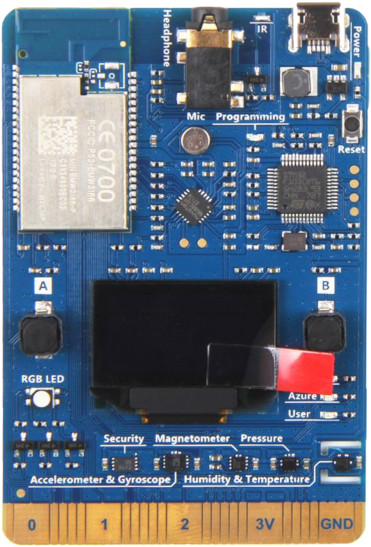
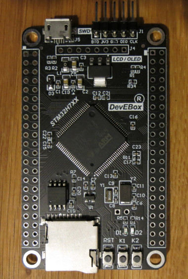
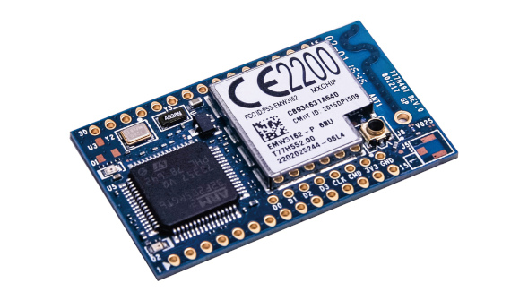
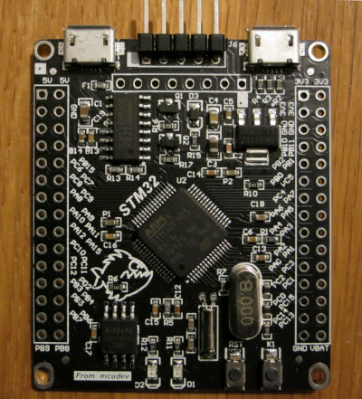
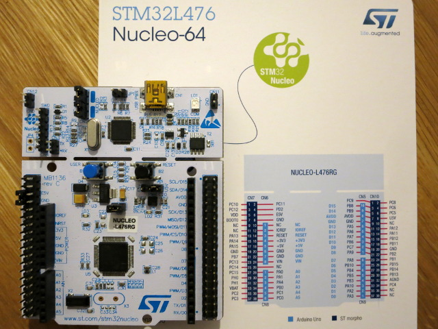
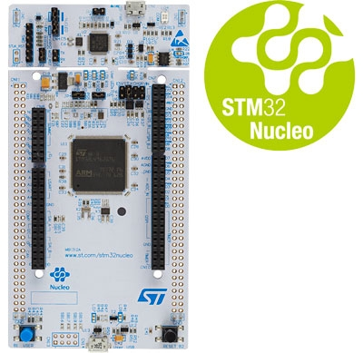

## Support for STM32 development boards

### Supported boards

#### [az3166](az3166)

MXCHIP [Azure IoT DevKit](https://www.mxchip.com/az3166): [EMW3166](https://en.mxchip.com/productinfo/244866.html) ([STM32F412RG](https://www.st.com/en/microcontrollers/stm32f412rg.html) + [BCM43362](http://www.cypress.com/products/wi-fi) + 2MB QSPI Flash)

#### [devebox-h743](devebox-h743)

[DevEBox STM32H743](https://mcudev.taobao.com/): ([STM32H743VIT6](https://www.st.com/en/microcontrollers-microprocessors/stm32h743vi.html) + 8MB QSPI Flash [W25Q64JVSIQ](https://www.winbond.com/resource-files/w25q64jv%20spi%20%20%20revc%2006032016%20kms.pdf))

#### [emw3162](emw3162)

MXCHIP [EMW3162](https://en.mxchip.com/productinfo/244895.html): ([STM32F205RGT6](https://www.st.com/en/microcontrollers/stm32f205rg.html) + [BCM43362](http://www.cypress.com/products/wi-fi))

#### [f4-discovery](f4-discovery)

ST [STM32F4-Discovery](https://www.st.com/web/catalog/tools/FM116/SC959/SS1532/PF252419)

#### [minipro-f405](minipro-f405)

[STM32_MiNi_Pro](https://mcudev.taobao.com/): ([STM32F405RGT6](https://www.st.com/en/microcontrollers-microprocessors/stm32f405rg.html) + 2MB SPI Flash [W25Q16JVSIQ](https://www.winbond.com/resource-files/w25q16jv%20spi%20revg%2003222018%20plus.pdf) + USB to UART/RESET/BOOT0 [CH340C](http://www.wch-ic.com/products/CH340.html))

#### [nucleo-l476rg](nucleo-l476rg)

ST [NUCLEO-L476RG](https://www.st.com/en/evaluation-tools/nucleo-l476rg.html)

#### [nucleo-l496zg](nucleo-l496zg)

ST [NUCLEO-L496ZG](https://www.st.com/en/evaluation-tools/nucleo-l496zg.html)

### Directory structure

Every supported board has its directory here. Each of them contains three subdirectories:

#### board

The `board` directory contains Go packages that provide the interface to the peripherals available on the board such as buttons, LEDs, etc.
There is also an `init` package that imported configures the whole system for typical usage.
Usually you don't need to import it explicitly because any other package in the `board` directory imports `init` itself to ensure proper operation.

#### doc

The `doc` directory may contain documentation, diagrams, photos and other useful resources.

#### examples

The `examples` directory contains simple programs that demonstrate how to use the available Go packages to work with the board and various external peripherals connected to it.
