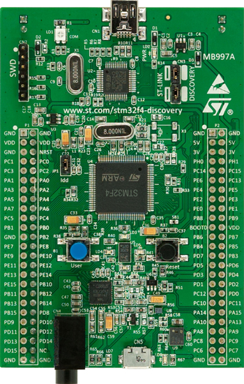

## Support for STM32 development boards

### The idea

The idea is to simplify the use of popular STM32 development boards.

Every development board directory contains set of packages (in `board` subdirectory) that provides the interface to the peripherals available on the board (for now the support is modest: only LEDs and buttons). The provided interface tries to be simple and uniform accros all development boards with the same or similar peripherals.

The `board/init` package when imported configures the whole system for typical usage. If you use any other package from `board` directory the `board/init` is imported implicitly to ensure the board is properly configured..

The *examples* subdirectory as the name suggests includes sample code, but also scripts and configuration that help to build, load and debug.

There is also *doc* subdirectory that contain useful information and other resources about this development board.

### Supported boards

[emw3162](emw3162): MXCHIP EMW3162 ([STM32F205RGT6](https://www.st.com/en/microcontrollers/stm32f205rg.html) + [BCM43362](http://www.cypress.com/products/wi-fi)), [website](https://en.mxchip.com/productinfo/244895.html)

[f4-discovery](f4-discovery): STM32F4-Discovery, [website](https://www.st.com/web/catalog/tools/FM116/SC959/SS1532/PF252419)

[nucleo-l476rg](nucleo-l476rg): NUCLEO-L476RG, [website](https://www.st.com/en/evaluation-tools/nucleo-l476rg.html)

[nucleo-l496zg](nucleo-l496zg): NUCLEO-L496ZG, [website](https://www.st.com/en/evaluation-tools/nucleo-l496zg.html)

